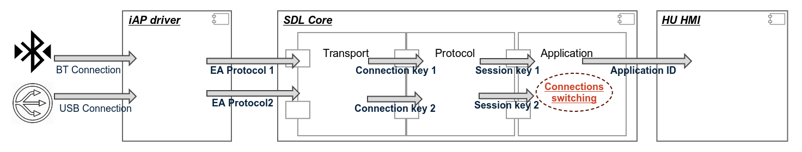

# Handling multiple connection to the same iOS device
* Proposal: [SDL-NNNN](NNNN-filename.md)
* Author: [Alexandr Galiuzov](https://github.com/AGaliuzov)
* Status: **Awaiting review**
* Impact: **Core**
 
## Introduction
This proposal is geared to cover the case when the one and the same iOS device has established both wired and wireless connection, so the system has to close the wireless and continue to work with wired.

## Motivation
According to the Apple recommendation the wired connection has priority over wireless one. To fit this expectation SDL has to
close the wireless one in favour of the wired. However switching the device connection causes the application re-registration process, which is not quite convinient for the end user. To decrease the user impact, connection type has to be changed without application unregistration. The user experience in this case remains uninpaired.

## Proposed solution
1. TransportManager has to be able to handle the case when wireless connected device has established wired connection
2. TransportManager has to support some timer for the reconnection. Once the timer exceeded and there is no registered application appeared 'TransportManager' triggers 'UnexpectedDisconnect' flow for the wireless device.
3. ApplicationManager has to support so-called 'reregister waitlist' which will include the id for all applications which were previously connected over the wireless device. Application from this list are remain registerd over HMI unless 'TransportManager' timer expired
4. ApplicationManager has to remove the application from this list in case of appropriate application has been reconnected or reconnection timeout has been triggered.
5. In case of application from 'wait list' has been successfuly registered 'ApplicationManager' notifies 'TransportManager' about successful reconnection.

## High-level-design

1. The 'TransportManager' handles the case when wireless connected device has established wired connection
    1.1 'TransportManager' notifies the ApplicationManager about device reconnection
    1.2 'TransportManager' closes the wireless session
    1.3 'TransportManager' starts the reconnection timer with value defined in the smartDeviceLink.ini file
2. 'ApplicationManager' supports the list of applications which are supposed to be reregistered due to connection switching flow
    2.1 'ApplicationManager' handles the 'RegisterAppInterface' request and compares 'wait_list' with registered application.
In case of coincidence the reconnection flow is considered as succeeded and 'ApplicationManager' notifies 'TransportManager'
about successful reconnection and 'TransportManager' stops the timer

